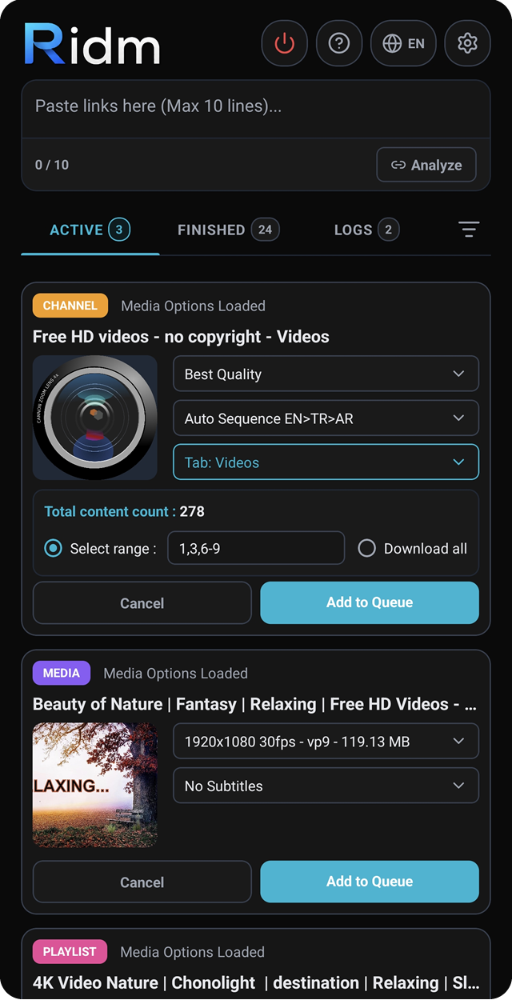
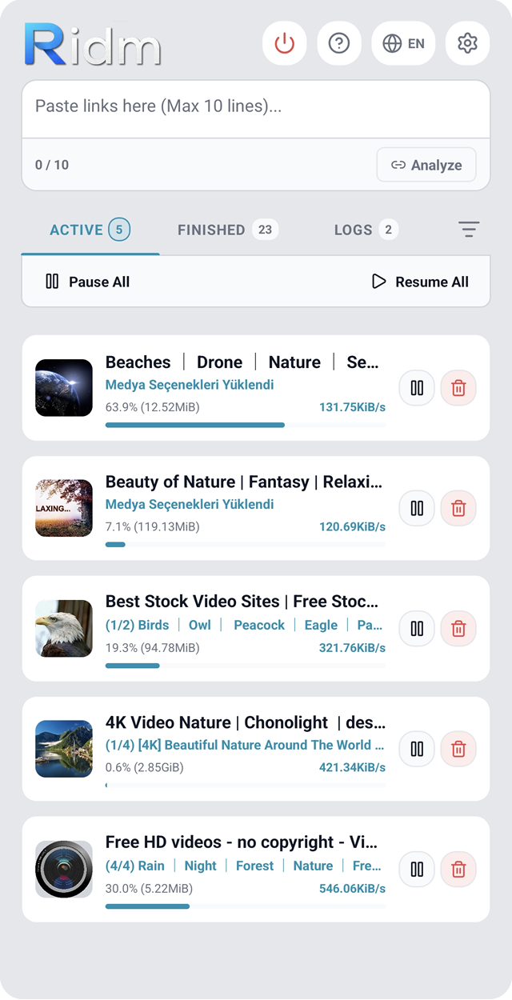
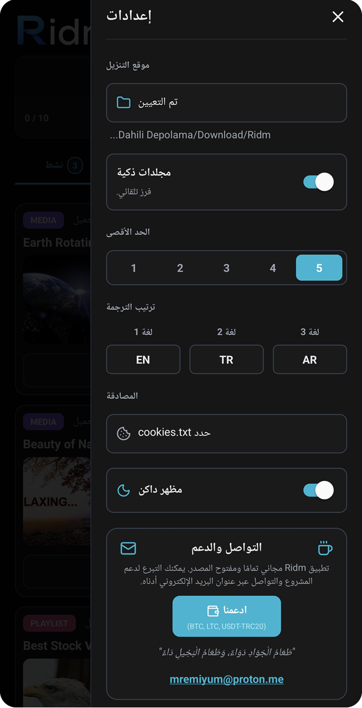

# Ridm 
> **Raid - inspect - download - manage**

Ridm, temel bir indirme yöneticisinin yanı sıra Youtube, Instagram gibi medya içeriklerini tek tek ya da toplu olarak indirme yeteneklerine sahip, açık kaynaklı ve 9 dil destekli güçlü bir medya yöneticisidir. Arka planda `yt-dlp` motorunun gücünü kullanır.

## 📱 Ekran Görüntüleri

  
  
  

## 🌟 Özellikler

* **🌍 Çoklu Dil Desteği:** Türkçe, İngilizce, Arapça, Çince, Hintçe, İspanyolca, Fransızca, Bengalce ve Rusça dillerinde tam destek.
* **🚀 Temel Kullanım & Entegrasyon:** Uygulama içerisine tek seferde enter ile ayrılmış max 10 link ekleyebilirsiniz. YouTube veya diğer uygulamalarda herhangi bir videoyu "Paylaş" diyerek Ridm'i seçtiğinizde, link otomatik olarak analiz edilir ve indirmeye hazır hale gelir.
* **📂 Akıllı Klasörleme:** Aktif edildiğinde indirmeleriniz türlerine göre (Video, Ses vb.) otomatik olarak alt klasörlere ayrılır.
* **🎞️ Gelişmiş Format Seçimi:** Playlist ve Kanal indirme kartlarında bulunan format seçiminde "En İyi Kalite"yi seçtiğinizde kaynak sunucudaki en yüksek çözünürlük ve kalitedeki videoları indirir. 2160p (4K) veya 1080p seçildiğinde, eğer o çözünürlükte video yoksa dosyayı atlar ve sıradakine geçer.
* **🎵 Ses ve Altyazı Desteği:** MP3, M4A ve Opus formatlarında sadece ses indirebilirsiniz. Altyazılı bir ses dosyası indirmek isterseniz **M4A** formatını seçmeniz gerekmektedir.
* **📝 Toplu Altyazı Tercihi:** Ayarlar menüsündeki 'Altyazı Tercih Sırası', Kanal ve Playlist gibi toplu indirmelerde her video için tek tek altyazı sorma zahmetini ortadan kaldırır. "Oto Sıralı" seçildiğinde sistem sırasıyla belirlediğiniz 3 dili arar ve bulduğunu gömer.

## ⚠️ Önemli Uyarılar

* **Pil Kısıtlamaları:** İndirme işleminin arka planda kesintisiz devam edebilmesi için uygulamanın Android güç seçeneklerinde pil kullanımının **"Kısıtlama Yok" (Unrestricted)** olarak ayarlanması gerekmektedir.
* **İndirme Konumu:** Uygulamayı ilk açtığınızda Ayarlar menüsünden indirmelerin kaydedileceği klasörü seçmeniz zorunludur.

## 🍪 Cookies / Kimlik Doğrulama
Instagram veya yaş kısıtlamalı YouTube içeriklerini indirebilmek için hesabınızı uygulamaya tanıtmanız gerekir:
1. Telefonunuzdaki tarayıcıdan (Firefox, Kiwi vb.) Firefox Browser ADD-ONS içerisinde `"cookies.txt"` eklentisini kurun.
2. Tarayıcıdan YouTube veya Instagram'a girip oturum açın.
3. Eklenti simgesine tıklayıp Download seçeneği ile cookies.txt dosyasını indirin (../Download/Kiwi/cookies.txt vb.)
4. Uygulama Ayarlarından "Cookies Seçiniz" butonuna tıklayıp bu dosyayı uygulamaya bağlayın.

## ☕ Destek & İletişim
Ridm tamamen ücretsiz ve açık kaynaklıdır. Projeye destek olmak, geliştirme sürecine katkıda bulunmak veya hata bildirimleri için bana ulaşabilirsiniz.

**Kripto Bağış Adresleri:**
* **Bitcoin (BTC):** `bc1qa5v5vlppp5nn9kdtt2wz4x9pfuupm92hjpd6eu`
* **Litecoin (LTC):** `Lf4HincsmEvEJ1cxwJkomXLN72JH7etWRY`
* **Tron (USDT-TRC20):** `TUZksjGTYmSeKaprQJQtomTdPXb4ew9mrp`

---
*Developed by mremiyum*     mremiyum@proton.me
